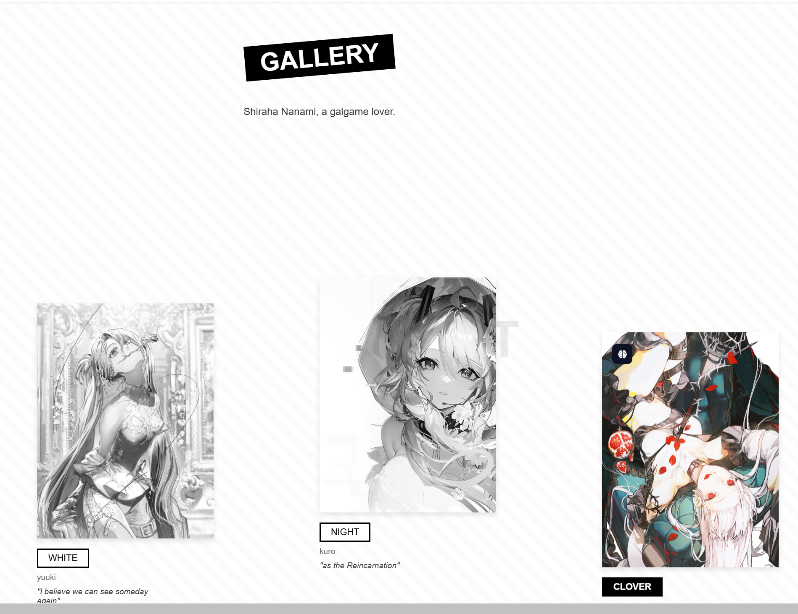
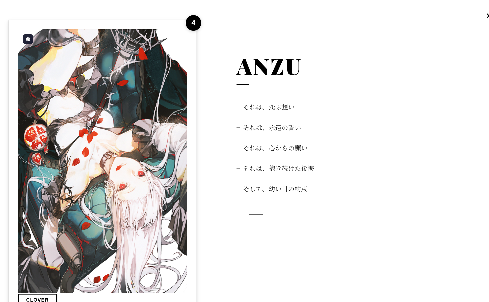

# 动漫角色图库 (Anime Character Gallery)




这是一个使用 React + TypeScript + Vite 构建的动漫角色展示网站。项目使用了现代的动画效果和响应式设计，为用户提供流畅的浏览体验。

## 功能特点

- 响应式图库布局
- 使用 Framer Motion 实现流畅的动画效果
- 基于 React Router 的页面导航
- TypeScript 类型支持
- 灰度图片效果

## 项目结构

```
src/
  ├── components/
  │   ├── Gallery.tsx      # 主图库组件
  │   └── GalleryDetail.css
  ├── assets/
  │   └── react.svg
  └── public/
      └── images/
          ├── 01.jpg
          ├── 02.jpg
          └── 03.jpg
```

## 技术栈

- React 18
- TypeScript
- Vite
- Framer Motion
- React Router
- ESLint

## 开发指南

### 安装依赖

```bash
npm install
```

### 启动开发服务器

```bash
npm run dev
```

### 构建生产版本

```bash
npm run build
```

## ESLint 配置

项目使用 ESLint 进行代码质量控制。如需修改配置，请参考 `eslint.config.js`。

## 许可证

MIT
